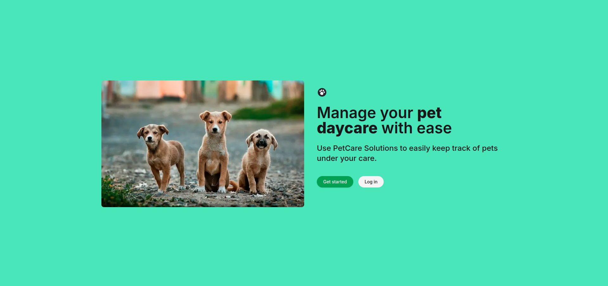
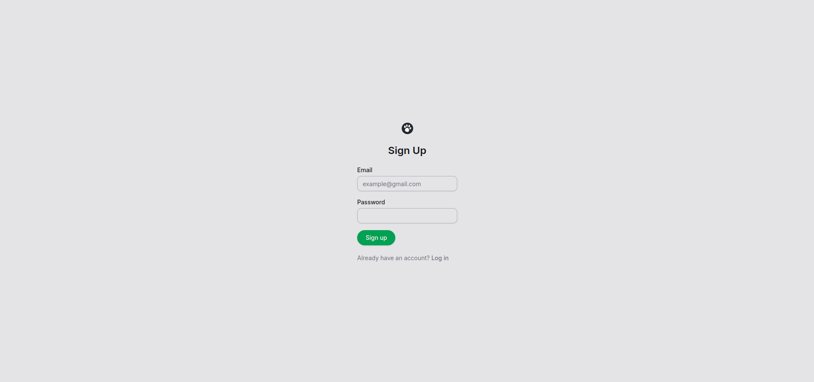
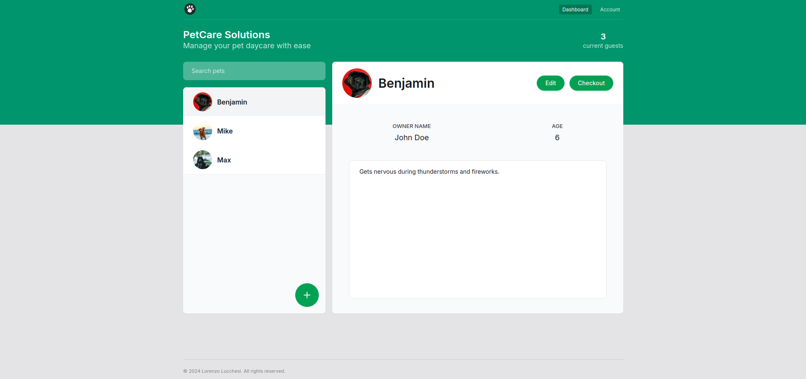
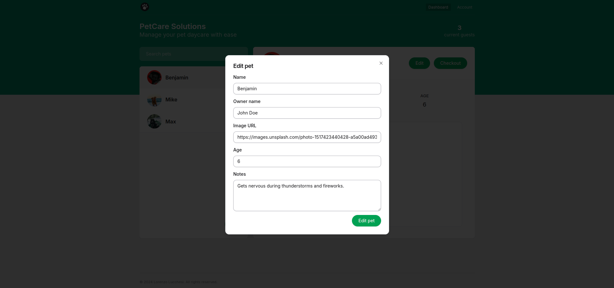
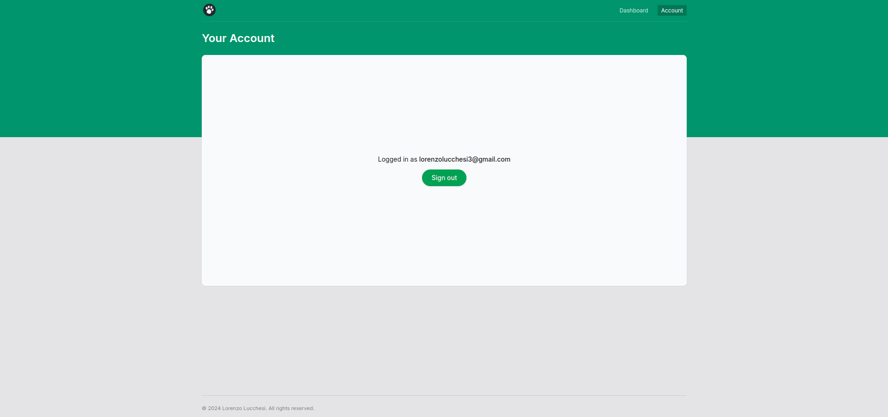

# PetCare Solutions

PetCare Solutions helps users easily manage pet information and simplifying pet care.

## Features

- 🐾 **Add and Edit Pets:** Easily create and update pet profiles with details like name, age, owner, and other important notes.
- 📋 **Manage Pet Information:** Track relevant information such as age, image, and notes about each pet.
- 🔒 **Secure Authentication:** Users can securely sign up and log in to manage their pets.
- 📈 **Dashboard:** A centralized dashboard to view and manage all your pets.

## Tech Stack

TypeScript, Next.js, Auth.js, Prisma, Zod, Tailwind, React Hook Form and Shadcn/ui.

## Screenshots

